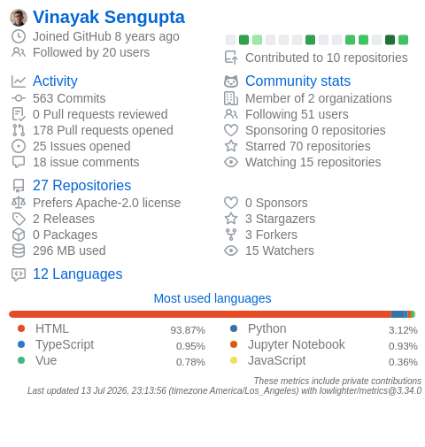

<!--
  Profile README for github.com/vinzlercodes
  Focus: LLM systems, applied ML, retrieval, and data platforms.
-->

# 👋 Hi, I’m Vinayak Sengupta

### Data Scientist & LLM Systems Engineer

I build **LLM + ML systems that actually ship** – from fine-tune-and-serve platforms and GraphRAG pipelines to model-agnostic explainability and data products.

 

---

## 🧠 What I do

- **LLM platforms & agents**
  - Fine-tune and serve open-source LLMs (Axolotl + QLoRA) behind **vLLM** for enterprise agent use cases.
  - Design guardrailed **RAG / GraphRAG** systems with content safety (OpenAI Moderation, NeMo Guardrails) and retrieval metrics baked in.

- **ML systems & explainability**
  - Ship **model-agnostic attribution and PDP** pipelines using **DuckDB + Arrow**, aligned with LightGBM + SHAP outputs for production dashboards.

- **Data & infra**
  - Build and harden **FastAPI** services, K8s reconciliation loops, and data pipelines in **SparkSQL**, PostgreSQL, and warehouses.

I care about **robustness, observability, and measurable impact** – not just getting a Jupyter notebook to “work.”

## 💼 Snapshot of recent work

### Aible – Data Scientist (2023–Present)

- **Custom LLM fine-tune & serve platform**
  - Architected a fault-tolerant fine-tune-and-serve platform (Axolotl + QLoRA + vLLM) for multiple open-source foundation models.
  - Automated checkpoint detection & recovery, cutting manual setup / monitoring by **~80%** and enabling a Fortune 50 telecom to ship a security metadata classifier on time.

- **Model-agnostic feature attribution & PDP**
  - Built a single-pass explanation pipeline using model predictions + univariate summaries with **DuckDB** pivoting over **Arrow** data.
  - Unified global + pairwise explanations across LightGBM and SHAP, and reduced per-feature PDP compute **17×** while keeping curve fidelity (ρ≈0.90).

- **Model reconciliation controller**
  - Re-architected a fragmented Flask process into a **FastAPI** proxy with an idempotent reconcile loop using DeepDiff + K8s helpers.
  - Consolidated four manual steps into one API and cut manual recovery effort by **90%**, speeding pod rollouts **3×** and eliminating double-launch incidents.

- **Graph-structured document summarization**
  - Implemented RAG + GraphRAG over **Neo4j** with embedding clustering, token-based splitting, BM25, MMR, and FlashRank-based re-ranking.
  - Integrated OpenAI Moderation + NeMo Guardrails and improved retrieval nDCG@k by **25%**, shipping a modular retrieval suite into production.

### Research & writing

- **PPO post-training for Llama text-to-SQL (3B)**
  - Engineered a PPO pipeline that boosted F1-SQL from **16% → 84%** using ~1k human feedback samples and ≈$11 of H100 compute, reaching task-bounded parity with an OpenAI o3-series model.

- **Prior ML work**
  - SATD detection and refactoring recommendation (capstone @ RIT).
  - Histopathology carcinoma classification using multi-level spatial fusion (CCIS book series, FTNCT 2019).
  - Long-form writing on Medium (Towards Data Science, The Startup, etc.) on topics from customer segmentation to the last 40 years of gaming.

## 🛠 Tech stack

**Languages**  
`Python` · `SQL` · `Cypher`

**ML / LLM**  
`PyTorch` · `TensorFlow` · `Keras` · `scikit-learn` · `LightGBM` · `SHAP` · `ONNX`  
`Axolotl` · `QLoRA` · `vLLM` · `LangChain` · `LlamaIndex` · `NeMo Microservices` · `NeMo Guardrails`  
`OpenAI` · `Vertex AI`

**Data & storage**  
`DuckDB` · `PostgreSQL` · `MongoDB` · `Neo4j` · `Chroma` · `PySpark`  
`AWS` · `GCP`

**Backend / infra**  
`FastAPI` · `Flask` · `Kubernetes` · `Docker` · `GitHub Actions`

## 📌 Selected projects (public repos)

Some older but representative public work:

- **[Gaming-Industry-Analysis](https://github.com/vinzlercodes/Gaming-Industry-Analysis)**  
  Data analysis of a 40-year gaming dataset – genre/platform trends, sales patterns, and publisher contributions, plus a companion blog post tying it all together.

- **[Prediction-of-Customer-Churn](https://github.com/vinzlercodes/Prediction-of-Customer-Churn)**  
  ANN-based churn prediction for banking customers, with extensive visualization (ROC, confusion matrix, pie charts, KDE, counter plots).

- **[Disaster-Response-Pipeline-Web-App](https://github.com/vinzlercodes/Disaster-Response-Pipeline-Web-App)**  
  End-to-end ETL + NLP + ML pipeline that powers a web app for classifying disaster-related messages into multiple categories.

- **[Recommendation-of-Refactoring-Techniques-to-address-Self-Admitted-Technical-Debt](https://github.com/vinzlercodes/Recommendation-of-Refactoring-Techniques-to-address-Self-Admitted-Technical-Debt)**  
  SATD detection and refactoring recommendation – the public side of your RIT capstone work.

## ✍️ Latest writing

<!-- BLOG-POST-LIST:START -->
- [The Essential Guide to Effectively Summarizing Massive Documents, Part 1](https://medium.com/data-science/demystifying-document-digestion-a-deep-dive-into-summarizing-massive-documents-part-1-53f2ed9a669d?source=rss-315151b8e67d------2)
- [Advancing the Power of Retrievers in RAG Frameworks](https://medium.com/swlh/exploring-the-core-of-augmented-intelligence-advancing-the-power-of-retrievers-in-rag-frameworks-3ef9fe273764?source=rss-315151b8e67d------2)
- [Customer Segmentation, Identifying the Profit Among the Loose Ends.](https://medium.com/swlh/customer-segmentation-identifying-the-profit-among-the-loose-ends-6fe4d6279873?source=rss-315151b8e67d------2)
- [The Last 40 Years of Gaming Industry, Unlocked.](https://medium.com/swlh/the-last-40-years-of-gaming-industry-unlocked-baf4699ad8ba?source=rss-315151b8e67d------2)
<!-- BLOG-POST-LIST:END -->

This section is auto-updated from my Medium RSS feed.

## 🗣 Talks & community

- Authored the core problem statement & evaluation metrics for the **UC Berkeley AI Summit 2023 – Data Science Hackathon**.
- Represented Aible at **Ai4 2023**, **Google Next 2024**, and **AWS Summit 2024**, running technical demos and stakeholder-facing discussions.
- Enjoy long-form writing on data, ML, and games whenever I can find the time.

## 📈 GitHub activity & stats

  

---

⚡ Fun fact: I will absolutely over-analyze both fragrance notes and video-game industry trends.
