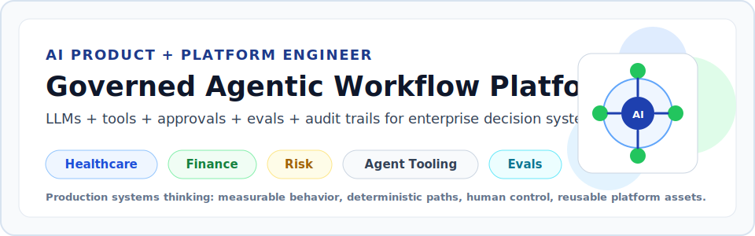
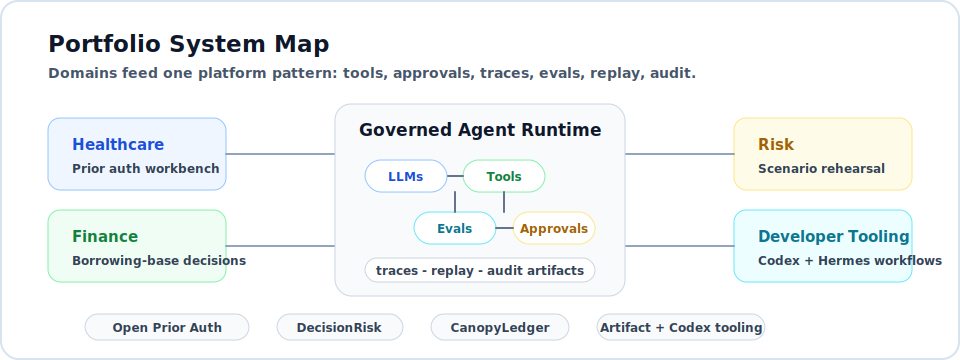
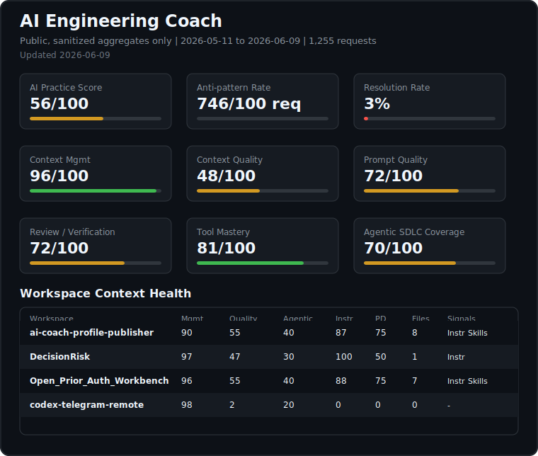

<!--
  Profile README for github.com/vinzlercodes
  Focus: AI-native product/platform engineering, agentic workflows, LLM systems, and governed enterprise decision systems.
-->

# Hi, I'm Vinayak Sengupta

### AI Product & Platform Engineer | Agentic Workflows | LLM Systems | Retrieval, Fine-Tuning & Evals

I build governed agentic workflow platforms where LLMs, tools, human approvals, evals, and audit trails turn AI capability into usable enterprise products across healthcare, finance, risk, and developer automation.

---

## What I Build

| Area | Current focus |
| --- | --- |
| Agent platforms | Multi-agent coordination, deterministic tool execution, human-in-the-loop confirmations, approval-gated writes, tool-call graphs, and enterprise workflow automation. |
| Domain AI products | Healthcare prior authorization, evidence-adjusted finance decisioning, risk simulation, document intelligence, and workflow copilots with clear non-production and safety boundaries. |
| LLM operations | SFT, DPO, PPO, QLoRA, Axolotl, vLLM, checkpoint recovery, model serving, and failure diagnostics for production AI workflows. |
| Retrieval and evaluation | RAG/GraphRAG over long-form and graph-structured documents, ranking quality, BM25, MMR, reranking, deterministic evals, replay artifacts, and nDCG@k measurement. |
| Explainability and analytics | Model-agnostic attribution, PDP workflows, KPI design, DuckDB/Arrow pipelines, SHAP alignment, and stakeholder-facing analytics products. |
| Open-source agent tooling | Codex/Hermes remote control, AI engineering telemetry, artifact-format evaluation, reusable CLI workflows, and privacy-safe publication pipelines. |
| Platform engineering | FastAPI services, TypeScript/Next.js apps, Kubernetes reconciliation loops, productized launch flows, health checks, observability, and reusable enterprise assets. |

I care about systems that are measurable, debuggable, and useful to the people who have to run them after the demo is over.

## Recent Work

### Aible - Data Scientist, AI-Native Systems & Enterprise Workflows

- Architected an NVIDIA NeMo Agent Toolkit LLM runtime for dynamic reasoning chains, multi-agent coordination, deterministic tool execution, and enterprise workflow automation.
- Built a FastAPI execution layer that converts user/model intent into runnable agent configurations across tools, document workflows, prediction scoring, and human-in-the-loop approvals.
- Designed a pluggable enterprise tool registry with persisted execution metadata and tool-call graphs for observability, reproducibility, workflow reuse, and operational debugging.
- Productized an OpenClaw-based agent platform with sandbox launch flows, tenant configuration, health checks, gateway reachability checks, Slack access, streaming responses, and failure diagnostics.

### AI Operations, Fine-Tuning & Reliability

- Led a fault-tolerant fine-tune-and-serve platform for enterprise AI use cases, translating customer requirements into scalable experimentation and deployment workflows.
- Implemented SFT and DPO workflows using Axolotl and QLoRA; automated checkpoint detection and recovery, reducing manual setup and monitoring effort by **80%**.
- Enabled a Fortune 50 telecom client to launch a security metadata classifier on schedule through a productionized fine-tuning and serving workflow.

### Retrieval, Document Intelligence & Explainability

- Designed retrieval workflows for graph-structured and long-form enterprise documents while balancing ranking quality, token constraints, modular experimentation, and production evaluation.
- Improved retrieval nDCG@k by **25%** through iterative tuning of BM25, Maximal Marginal Relevance, and reranking components.
- Led a standardized model explainability/PDP analytics workflow that reduced per-feature computation time by **17x** while maintaining median curve fidelity around **0.90**.

## Current Product Builds

| Build                                                                                  | Domain | What it explores |
| --- | --- | --- |
| [Open Prior Auth Workbench](https://github.com/vinzlercodes/Open_Prior_Auth_Workbench) | Healthcare | FHIR-first prior authorization workbench for requirement discovery, deterministic questionnaire prefill, evidence intake, packet assembly, payer-status loops, human review, audit trails, and agent evals. |
| [DecisionRisk](https://github.com/vinzlercodes/DecisionRisk)                           | Risk | MiroFish-first decision rehearsal engine with evidence graphs, scenario ensembles, adversarial council review, transparent risk metrics, provenance validation, replay artifacts, and auditable Risk Dockets. |
| CanopyLedger (Coming Soon)                                                             | Finance | Private evidence-adjusted borrowing-base decisioning build for coffee trade finance, with immutable facility snapshots, reproducible collateral valuation, governed decisions, idempotent APIs, and integrity checks. |
| [codex-telegram-remote](https://github.com/vinzlercodes/codex-telegram-remote)         | Agent tooling | Hermes-native Telegram control for Codex threads, workspace/status checks, remote steering, approval routing, and completion summaries through local app-server boundaries. |
| [artifact-format-eval](https://github.com/vinzlercodes/artifact-format-eval)           | Agent evals | API-key-free benchmark comparing Markdown, HTML, JSON-rendered, and notebook artifacts across cost, accessibility, security, reviewability, and reader-task coverage. |

## Technical Toolkit

**Agentic AI & LLM systems**
`multi-agent orchestration` · `tool registries` · `approval gates` · `runtime traces` · `deterministic evals` · `AgentOps` · `human-in-the-loop flows` · `RAG` · `GraphRAG` · `SFT` · `DPO` · `PPO` · `QLoRA` · `Axolotl` · `vLLM` · `LangChain` · `LlamaIndex` · `NVIDIA NeMo Toolkit` · `NeMo Guardrails` · `OpenAI` · `Vertex AI`

**Platforms, data & backend**
`Python` · `TypeScript` · `SQL` · `Cypher` · `FastAPI` · `Flask` · `Next.js` · `PySpark` · `DuckDB` · `PostgreSQL` · `SQLite` · `MongoDB` · `Neo4j` · `Chroma` · `AWS` · `GCP` · `Docker` · `Kubernetes` · `GitHub Actions` · `OpenTelemetry` · `Langfuse`

**ML, product & analytics**
`PyTorch` · `TensorFlow` · `Keras` · `scikit-learn` · `LightGBM` · `SHAP` · `ONNX` · `PDP` · `KPI design` · `stakeholder discovery` · `PRDs` · `MVP roadmaps` · `success metrics`

## Selected Public Systems

| Project | Signal |
| --- | --- |
| [Open Prior Auth Workbench](https://github.com/vinzlercodes/Open_Prior_Auth_Workbench) | Healthcare agent workflow substrate with ToolNet-style tools, approvals, traces, deterministic evals, synthetic data, and standards-shaped local gateway routes. |
| [DecisionRisk](https://github.com/vinzlercodes/DecisionRisk) | Risk simulation platform for consequential decision rehearsal, scenario replay, grounded rationale, dissent tracking, safety gates, and reviewable regression reports. |
| [codex-telegram-remote](https://github.com/vinzlercodes/codex-telegram-remote) | Open-source agentic developer tooling for controlling Codex from Telegram through Hermes with local runtime state and approval boundaries. |
| [artifact-format-eval](https://github.com/vinzlercodes/artifact-format-eval) | Evaluation harness for agent-generated artifacts, measuring accessibility, security, reviewability, mutation impact, and reader-task coverage without API keys. |
| [ai-coach-profile-publisher](https://github.com/vinzlercodes/ai-coach-profile-publisher) | Privacy-safe publisher for AI Engineer Coach metrics, sanitized JSON dispatch, GitHub Actions rendering, and public SVG profile cards. |

## Foundations

Earlier work spans [gaming-industry analytics](https://github.com/vinzlercodes/Gaming-Industry-Analysis), [customer churn prediction](https://github.com/vinzlercodes/Prediction-of-Customer-Churn), [recommendation systems](https://github.com/vinzlercodes/Recommendation-Engine-with-IBM), [disaster-response NLP pipelines](https://github.com/vinzlercodes/Disaster-Response-Pipeline-Web-App), SATD refactoring recommendation, hierarchical-attention document classification, and breast histopathology image classification research. That foundation now feeds more product-shaped agent, retrieval, eval, and decision-workflow systems.

## Writing & Research

<!-- BLOG-POST-LIST:START -->
- [The Essential Guide to Effectively Summarizing Massive Documents, Part 1](https://medium.com/data-science/demystifying-document-digestion-a-deep-dive-into-summarizing-massive-documents-part-1-53f2ed9a669d?source=rss-315151b8e67d------2)
- [Advancing the Power of Retrievers in RAG Frameworks](https://medium.com/data-science-collective/exploring-the-core-of-augmented-intelligence-advancing-the-power-of-retrievers-in-rag-frameworks-3ef9fe273764?source=rss-315151b8e67d------2)
- [Customer Segmentation, Identifying the Profit Among the Loose Ends.](https://medium.com/swlh/customer-segmentation-identifying-the-profit-among-the-loose-ends-6fe4d6279873?source=rss-315151b8e67d------2)
- [The Last 40 Years of Gaming Industry, Unlocked.](https://medium.com/swlh/the-last-40-years-of-gaming-industry-unlocked-baf4699ad8ba?source=rss-315151b8e67d------2)
<!-- BLOG-POST-LIST:END -->

Auto-updated from my Medium RSS feed.

I write technical explainers that connect system design to reader-visible tradeoffs: retrieval quality, long-document summarization, RAG failure modes, clustering, applied analytics, and how AI outputs should be evaluated as artifacts rather than demos.

Other work: PPO post-training for Llama text-to-SQL, SATD detection and refactoring recommendation, and histopathology carcinoma classification using multi-level spatial fusion.

## Talks & Community

- Authored the core problem statement and evaluation metrics for the **UC Berkeley AI Summit 2023 - Data Science Hackathon**.
- Represented Aible at **Ai4 2023**, **Google Next 2024**, and **AWS Summit 2024**, translating technical systems into demos and customer conversations.
- Write long-form pieces on document summarization, retrieval systems, RAG evaluation, customer segmentation, applied AI, and gaming industry analysis.

## GitHub Activity & Analytics

### AI Engineering Coach Metrics

  

These metrics summarize how I use AI coding tools in practice, not just how much AI-generated code I produce. The card is generated from sanitized local AI Engineer Coach aggregates and is meant to show AI engineering discipline across context quality, prompt clarity, review habits, tool usage, and agentic SDLC coverage.

| Metric | What it means |
|---|---|
| **AI Practice Score** | Overall signal of AI-assisted engineering maturity across the tracked categories. |
| **Anti-pattern Rate** | Number of detected AI workflow anti-patterns per 100 requests. Lower is better. |
| **Resolution Rate** | Share of detected anti-patterns that were improved or resolved over the measured period. |
| **Context Health** | How well my projects provide the context an AI agent needs: instructions, workspace structure, and agent-readiness. |
| **Prompt Quality** | How clearly I frame tasks, constraints, expected outputs, and review criteria for AI tools. |
| **Review / Verification** | How consistently AI-generated work is checked through review, testing, validation, or manual inspection. |
| **Tool Mastery** | How effectively I use AI tools, workflows, and coding assistants beyond simple prompt-and-paste usage. |
| **Agentic SDLC Coverage** | How broadly I use AI across planning, implementation, testing, review, documentation, and iteration. |

_Public card only. Raw prompts, private code, workspace names, file paths, model names, screenshots, and detailed anti-pattern records are not published._

  

| Signal | What to look for |
| --- | --- |
| Languages | A practical mix of data, backend, notebooks, and web-facing work rather than a single narrow stack. |
| Repositories | Recent public systems show a shift from notebooks and ML pipelines toward agentic workflow products, eval harnesses, and developer tooling. |
| Writing | Medium activity makes the technical reasoning visible, especially around retrieval, summarization, RAG evaluation, and applied analytics. |
| Activity feed | Recent public GitHub events are generated below so profile movement is visible between larger project updates. |

### Recent GitHub Activity

<!--START_SECTION:activity-->
1. 🎉 Merged PR [#83](https://github.com/vinzlercodes/Open_Prior_Auth_Workbench/pull/83) in [vinzlercodes/Open_Prior_Auth_Workbench](https://github.com/vinzlercodes/Open_Prior_Auth_Workbench)
2. 💪 Opened PR [#83](https://github.com/vinzlercodes/Open_Prior_Auth_Workbench/pull/83) in [vinzlercodes/Open_Prior_Auth_Workbench](https://github.com/vinzlercodes/Open_Prior_Auth_Workbench)
3. 🎉 Merged PR [#82](https://github.com/vinzlercodes/Open_Prior_Auth_Workbench/pull/82) in [vinzlercodes/Open_Prior_Auth_Workbench](https://github.com/vinzlercodes/Open_Prior_Auth_Workbench)
4. 💪 Opened PR [#82](https://github.com/vinzlercodes/Open_Prior_Auth_Workbench/pull/82) in [vinzlercodes/Open_Prior_Auth_Workbench](https://github.com/vinzlercodes/Open_Prior_Auth_Workbench)
5. 🎉 Merged PR [#81](https://github.com/vinzlercodes/Open_Prior_Auth_Workbench/pull/81) in [vinzlercodes/Open_Prior_Auth_Workbench](https://github.com/vinzlercodes/Open_Prior_Auth_Workbench)
6. 💪 Opened PR [#81](https://github.com/vinzlercodes/Open_Prior_Auth_Workbench/pull/81) in [vinzlercodes/Open_Prior_Auth_Workbench](https://github.com/vinzlercodes/Open_Prior_Auth_Workbench)
7. 🎉 Merged PR [#80](https://github.com/vinzlercodes/Open_Prior_Auth_Workbench/pull/80) in [vinzlercodes/Open_Prior_Auth_Workbench](https://github.com/vinzlercodes/Open_Prior_Auth_Workbench)
8. 🎉 Merged PR [#79](https://github.com/vinzlercodes/Open_Prior_Auth_Workbench/pull/79) in [vinzlercodes/Open_Prior_Auth_Workbench](https://github.com/vinzlercodes/Open_Prior_Auth_Workbench)
9. 🎉 Merged PR [#78](https://github.com/vinzlercodes/Open_Prior_Auth_Workbench/pull/78) in [vinzlercodes/Open_Prior_Auth_Workbench](https://github.com/vinzlercodes/Open_Prior_Auth_Workbench)
10. 💪 Opened PR [#80](https://github.com/vinzlercodes/Open_Prior_Auth_Workbench/pull/80) in [vinzlercodes/Open_Prior_Auth_Workbench](https://github.com/vinzlercodes/Open_Prior_Auth_Workbench)
<!--END_SECTION:activity-->

---

Fun fact: I will absolutely over-analyze both fragrance notes and video-game industry trends.
